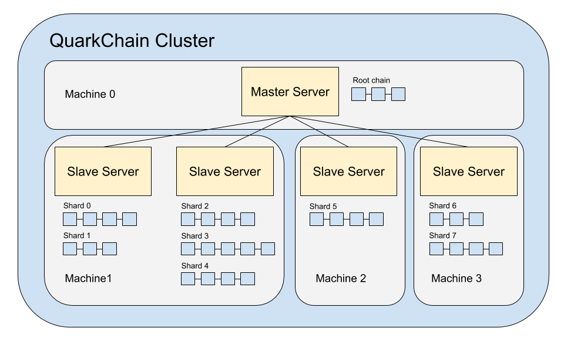

# Quarkchain performance evaluation


3 master nodes
- One bootstrap node

6 slave nodes

## Build docker image
```sh

docker build -t quarkchain .

# Publish to docker hub
QUARKCHAIN_IMAGE=$(cat ./quarkchain.image)
#QUARKCHAIN_IMAGE="qc:tps"

```

## Update performance script
```sh

cd  scripts
# Generate scripts on nodes
./generate_start_script.sh  config-sh1024-s256-n6.json


# Start clusters
./start_cluster.sh


# Check stats
# On bootstrap node
~/pyquarkchain/quarkchain/tools# pypy3 stats

```